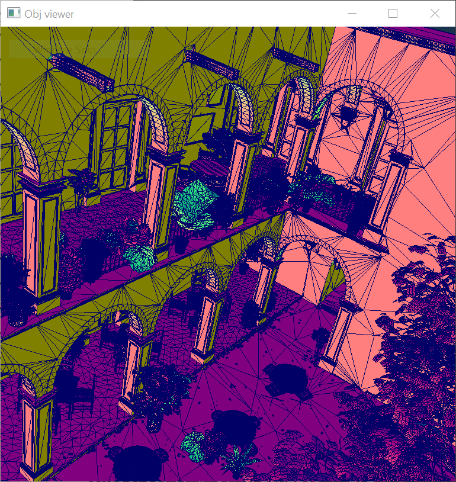

# tinyobjloader

[](https://badge.fury.io/py/tinyobjloader)

Tiny but powerful single file wavefront obj loader written in C++11. No dependency except for C++ STL. It can parse over 10M polygons with moderate memory and time.

`tinyobjloader` is good for embedding .obj loader to your (global illumination) renderer ;-)

If you are looking for C99 version, please see https://github.com/syoyo/tinyobjloader-c .

Version notice
--------------

We recommend using the `release` (main) branch. It contains the v2.0 release candidate. Most features are now nearly robust and stable. (The remaining task for release v2.0 is polishing C++ and Python API, and fix built-in triangulation code).

We have released new version v1.0.0 on 20 Aug, 2016.
Old version is available as `v0.9.x` branch https://github.com/syoyo/tinyobjloader/tree/v0.9.x

## What's new

* 22 May, 2026 : Added an optimized in-header loader `LoadObjOpt` with optional multithreading/SIMD (see [Optimized loader](#optimized-loader)).
* 29 Jul, 2021 : Added Mapbox's earcut for robust triangulation. Also fixes triangulation bug(still there is some issue in built-in triangulation algorithm: https://github.com/tinyobjloader/tinyobjloader/issues/319).
* 19 Feb, 2020 : The repository has been moved to https://github.com/tinyobjloader/tinyobjloader !
* 18 May, 2019 : Python binding!(See `python` folder. Also see https://pypi.org/project/tinyobjloader/)
* 14 Apr, 2019 : Bump version v2.0.0 rc0. New C++ API and python bindings!(1.x API still exists for backward compatibility)
* 20 Aug, 2016 : Bump version v1.0.0. New data structure and API!

## Requirements

* C++11 compiler

### Old version

Previous old version is available in `v0.9.x` branch.

## Example


tinyobjloader can successfully load 6M triangles Rungholt scene.
http://casual-effects.com/data/index.html



* [examples/viewer/](examples/viewer) OpenGL .obj viewer
* [examples/callback_api/](examples/callback_api/) Callback API example
* [examples/voxelize/](examples/voxelize/) Voxelizer example


## Features

* Group(parse multiple group name)
* Vertex
  * Vertex color(as an extension: https://blender.stackexchange.com/questions/31997/how-can-i-get-vertex-painted-obj-files-to-import-into-blender)
* Texcoord
* Normal
* Crease tag('t'). This is OpenSubdiv specific(not in wavefront .obj specification)
* Callback API for custom loading.
* Double precision support(for HPC application).
* Smoothing group
* Python binding : See `python` folder.
  * Precompiled binary(manylinux1-x86_64 only) is hosted at pypi https://pypi.org/project/tinyobjloader/)

### Primitives

* [x] face(`f`)
* [x] lines(`l`)
* [ ] points(`p`)
* [ ] curve
* [ ] 2D curve
* [ ] surface.
* [ ] Free form curve/surfaces

### Material

* PBR material extension for .MTL. Please see [pbr-mtl.md](pbr-mtl.md) for details.
* Texture options
* Unknown material attributes are returned as key-value(value is string) map.

## TODO

* [ ] Fix obj_sticker example.
* [ ] More unit test codes.

## License

TinyObjLoader is licensed under MIT license.

### Third party licenses.

* pybind11 : BSD-style license.
* mapbox earcut.hpp: ISC License.

## Usage

### Installation

One option is to simply copy the header file into your project and to make sure that `TINYOBJLOADER_IMPLEMENTATION` is defined exactly once.

### Data format

`attrib_t` contains single and linear array of vertex data(position, normal and texcoord).

```
attrib_t::vertices => 3 floats per vertex

       v[0]        v[1]        v[2]        v[3]               v[n-1]
  +-----------+-----------+-----------+-----------+      +-----------+
  | x | y | z | x | y | z | x | y | z | x | y | z | .... | x | y | z |
  +-----------+-----------+-----------+-----------+      +-----------+

attrib_t::normals => 3 floats per vertex

       n[0]        n[1]        n[2]        n[3]               n[n-1]
  +-----------+-----------+-----------+-----------+      +-----------+
  | x | y | z | x | y | z | x | y | z | x | y | z | .... | x | y | z |
  +-----------+-----------+-----------+-----------+      +-----------+

attrib_t::texcoords => 2 floats per vertex

       t[0]        t[1]        t[2]        t[3]               t[n-1]
  +-----------+-----------+-----------+-----------+      +-----------+
  |  u  |  v  |  u  |  v  |  u  |  v  |  u  |  v  | .... |  u  |  v  |
  +-----------+-----------+-----------+-----------+      +-----------+

attrib_t::colors => 3 floats per vertex(vertex color. optional)

       c[0]        c[1]        c[2]        c[3]               c[n-1]
  +-----------+-----------+-----------+-----------+      +-----------+
  | x | y | z | x | y | z | x | y | z | x | y | z | .... | x | y | z |
  +-----------+-----------+-----------+-----------+      +-----------+

```

Each `shape_t::mesh_t` does not contain vertex data but contains array index to `attrib_t`.
See `loader_example.cc` for more details.


```

mesh_t::indices => array of vertex indices.

  +----+----+----+----+----+----+----+----+----+----+     +--------+
  | i0 | i1 | i2 | i3 | i4 | i5 | i6 | i7 | i8 | i9 | ... | i(n-1) |
  +----+----+----+----+----+----+----+----+----+----+     +--------+

Each index has an array index to attrib_t::vertices, attrib_t::normals and attrib_t::texcoords.

mesh_t::num_face_vertices => array of the number of vertices per face(e.g. 3 = triangle, 4 = quad , 5 or more = N-gons).


  +---+---+---+        +---+
  | 3 | 4 | 3 | ...... | 3 |
  +---+---+---+        +---+
    |   |   |            |
    |   |   |            +-----------------------------------------+
    |   |   |                                                      |
    |   |   +------------------------------+                       |
    |   |                                  |                       |
    |   +------------------+               |                       |
    |                      |               |                       |
    |/                     |/              |/                      |/

 mesh_t::indices

  |    face[0]   |       face[1]     |    face[2]   |     |      face[n-1]           |
  +----+----+----+----+----+----+----+----+----+----+     +--------+--------+--------+
  | i0 | i1 | i2 | i3 | i4 | i5 | i6 | i7 | i8 | i9 | ... | i(n-3) | i(n-2) | i(n-1) |
  +----+----+----+----+----+----+----+----+----+----+     +--------+--------+--------+

```

Note that when `triangulate` flag is true in `tinyobj::LoadObj()` argument, `num_face_vertices` are all filled with 3(triangle).

### float data type

TinyObjLoader now use `real_t` for floating point data type.
Default is `float(32bit)`.
You can enable `double(64bit)` precision by using `TINYOBJLOADER_USE_DOUBLE` define.

### High-performance float parsing (fast_float)

By default, TinyObjLoader embeds [fast_float v8.0.2](https://github.com/fastfloat/fast_float)
for ~3× faster, bit-exact ASCII-to-float conversion (equivalent to `strtod` but without locale overhead).

To opt out and use the built-in hand-written parser instead, define:

```c++
#define TINYOBJLOADER_DISABLE_FAST_FLOAT
#define TINYOBJLOADER_IMPLEMENTATION
#include "tiny_obj_loader.h"
```

**Note:** If your project already includes `fast_float` under the `fast_float` namespace,
defining `TINYOBJLOADER_DISABLE_FAST_FLOAT` avoids a redefinition conflict.

### Robust triangulation

When you enable `triangulation`(default is enabled),
TinyObjLoader triangulate polygons(faces with 4 or more vertices).

Built-in triangulation code may not work well in some polygon shape.

You can define `TINYOBJLOADER_USE_MAPBOX_EARCUT` for robust triangulation using `mapbox/earcut.hpp`.
This requires C++11 compiler though. And you need to copy `mapbox/earcut.hpp` to your project.
If you have your own `mapbox/earcut.hpp` file incuded in your project, you can define `TINYOBJLOADER_DONOT_INCLUDE_MAPBOX_EARCUT` so that `mapbox/earcut.hpp` is not included inside of `tiny_obj_loader.h`.

#### Example code (Deprecated API)

```c++
#define TINYOBJLOADER_IMPLEMENTATION // define this in only *one* .cc
// Optional. define TINYOBJLOADER_USE_MAPBOX_EARCUT gives robust triangulation. Requires C++11
//#define TINYOBJLOADER_USE_MAPBOX_EARCUT
#include "tiny_obj_loader.h"

std::string inputfile = "cornell_box.obj";
tinyobj::attrib_t attrib;
std::vector<tinyobj::shape_t> shapes;
std::vector<tinyobj::material_t> materials;

std::string warn;
std::string err;

bool ret = tinyobj::LoadObj(&attrib, &shapes, &materials, &warn, &err, inputfile.c_str());

if (!warn.empty()) {
  std::cout << warn << std::endl;
}

if (!err.empty()) {
  std::cerr << err << std::endl;
}

if (!ret) {
  exit(1);
}

// Loop over shapes
for (size_t s = 0; s < shapes.size(); s++) {
  // Loop over faces(polygon)
  size_t index_offset = 0;
  for (size_t f = 0; f < shapes[s].mesh.num_face_vertices.size(); f++) {
    size_t fv = size_t(shapes[s].mesh.num_face_vertices[f]);

    // Loop over vertices in the face.
    for (size_t v = 0; v < fv; v++) {
      // access to vertex
      tinyobj::index_t idx = shapes[s].mesh.indices[index_offset + v];

      tinyobj::real_t vx = attrib.vertices[3*size_t(idx.vertex_index)+0];
      tinyobj::real_t vy = attrib.vertices[3*size_t(idx.vertex_index)+1];
      tinyobj::real_t vz = attrib.vertices[3*size_t(idx.vertex_index)+2];

      // Check if `normal_index` is zero or positive. negative = no normal data
      if (idx.normal_index >= 0) {
        tinyobj::real_t nx = attrib.normals[3*size_t(idx.normal_index)+0];
        tinyobj::real_t ny = attrib.normals[3*size_t(idx.normal_index)+1];
        tinyobj::real_t nz = attrib.normals[3*size_t(idx.normal_index)+2];
      }

      // Check if `texcoord_index` is zero or positive. negative = no texcoord data
      if (idx.texcoord_index >= 0) {
        tinyobj::real_t tx = attrib.texcoords[2*size_t(idx.texcoord_index)+0];
        tinyobj::real_t ty = attrib.texcoords[2*size_t(idx.texcoord_index)+1];
      }
      // Optional: vertex colors
      // tinyobj::real_t red   = attrib.colors[3*size_t(idx.vertex_index)+0];
      // tinyobj::real_t green = attrib.colors[3*size_t(idx.vertex_index)+1];
      // tinyobj::real_t blue  = attrib.colors[3*size_t(idx.vertex_index)+2];
    }
    index_offset += fv;

    // per-face material
    shapes[s].mesh.material_ids[f];
  }
}

```

#### Example code (New Object Oriented API)

```c++
#define TINYOBJLOADER_IMPLEMENTATION // define this in only *one* .cc
// Optional. define TINYOBJLOADER_USE_MAPBOX_EARCUT gives robust triangulation. Requires C++11
//#define TINYOBJLOADER_USE_MAPBOX_EARCUT
#include "tiny_obj_loader.h"


std::string inputfile = "cornell_box.obj";
tinyobj::ObjReaderConfig reader_config;
reader_config.mtl_search_path = "./"; // Path to material files

tinyobj::ObjReader reader;

if (!reader.ParseFromFile(inputfile, reader_config)) {
  if (!reader.Error().empty()) {
      std::cerr << "TinyObjReader: " << reader.Error();
  }
  exit(1);
}

if (!reader.Warning().empty()) {
  std::cout << "TinyObjReader: " << reader.Warning();
}

auto& attrib = reader.GetAttrib();
auto& shapes = reader.GetShapes();
auto& materials = reader.GetMaterials();

// Loop over shapes
for (size_t s = 0; s < shapes.size(); s++) {
  // Loop over faces(polygon)
  size_t index_offset = 0;
  for (size_t f = 0; f < shapes[s].mesh.num_face_vertices.size(); f++) {
    size_t fv = size_t(shapes[s].mesh.num_face_vertices[f]);

    // Loop over vertices in the face.
    for (size_t v = 0; v < fv; v++) {
      // access to vertex
      tinyobj::index_t idx = shapes[s].mesh.indices[index_offset + v];
      tinyobj::real_t vx = attrib.vertices[3*size_t(idx.vertex_index)+0];
      tinyobj::real_t vy = attrib.vertices[3*size_t(idx.vertex_index)+1];
      tinyobj::real_t vz = attrib.vertices[3*size_t(idx.vertex_index)+2];

      // Check if `normal_index` is zero or positive. negative = no normal data
      if (idx.normal_index >= 0) {
        tinyobj::real_t nx = attrib.normals[3*size_t(idx.normal_index)+0];
        tinyobj::real_t ny = attrib.normals[3*size_t(idx.normal_index)+1];
        tinyobj::real_t nz = attrib.normals[3*size_t(idx.normal_index)+2];
      }

      // Check if `texcoord_index` is zero or positive. negative = no texcoord data
      if (idx.texcoord_index >= 0) {
        tinyobj::real_t tx = attrib.texcoords[2*size_t(idx.texcoord_index)+0];
        tinyobj::real_t ty = attrib.texcoords[2*size_t(idx.texcoord_index)+1];
      }

      // Optional: vertex colors
      // tinyobj::real_t red   = attrib.colors[3*size_t(idx.vertex_index)+0];
      // tinyobj::real_t green = attrib.colors[3*size_t(idx.vertex_index)+1];
      // tinyobj::real_t blue  = attrib.colors[3*size_t(idx.vertex_index)+2];
    }
    index_offset += fv;

    // per-face material
    shapes[s].mesh.material_ids[f];
  }
}

```


## Optimized loader

For large `.obj` files, tinyobjloader ships an optimized in-header loader,
`LoadObjOpt` (C++11 required). It parses the whole buffer in one pass and can
optionally use multiple threads and SIMD line scanning. It does fewer error
checks than the standard loader but handles most real-world `.obj` data.

The result reuses the standard `attrib` / `shapes.mesh.*` layout, so the
iteration code shown above works unchanged.

```c++
#define TINYOBJLOADER_IMPLEMENTATION
// Optional speed-ups (all OFF by default; require C++11):
//#define TINYOBJLOADER_USE_MULTITHREADING  // multi-threaded parsing
//#define TINYOBJLOADER_USE_SIMD            // SIMD (SSE2/AVX2/NEON) newline scan
#include "tiny_obj_loader.h"

tinyobj::basic_attrib_t<> attrib;
std::vector<tinyobj::basic_shape_t<>> shapes;
std::vector<tinyobj::material_t> materials;
std::string warn, err;

tinyobj::OptLoadConfig config;
config.triangulate = true;
config.num_threads = -1; // -1 = hardware_concurrency, 0/1 = single-threaded.
                         // Effective only with TINYOBJLOADER_USE_MULTITHREADING.

bool ok = tinyobj::LoadObjOpt(&attrib, &shapes, &materials, &warn, &err,
                              "large_scene.obj", /* mtl_basedir */ nullptr,
                              config);
if (!warn.empty()) std::cout << warn;
if (!ok) { std::cerr << err; return -1; }
// attrib.vertices/.normals/.texcoords and shapes[s].mesh.* match the standard
// loader — iterate exactly as in the example above.
```

A `LoadObjOptTyped` variant is also available; it returns an `OptResult` whose
arrays are backed by a single arena allocator and only allocates optional
arrays (vertex weights, texcoord `w`, colors, ...) when the input contains
them — handy when minimizing allocations matters. An experimental stream-based
loader lives under `experimental/stream/`.

## Python binding

```
$ python -m pip install tinyobjloader
```

See [python/sample.py](python/sample.py) for example use of Python binding of tinyobjloader.

### CI + PyPI upload

cibuildwheels + twine upload for each git tagging event is handled in Github Actions.

#### How to bump version(For developer)

* Bump version in CMakeLists.txt
* Commit and push `release`. Confirm C.I. build is OK.
* Create tag starting with `v`(e.g. `v2.1.0`)
* `git push --tags`
  * version settings is automatically handled in python binding through setuptools_scm.
  * cibuildwheels + pypi upload (through twine) will be automatically triggered in Github Actions.

## Tests

Unit tests are provided in `tests` directory. See `tests/README.md` for details.
